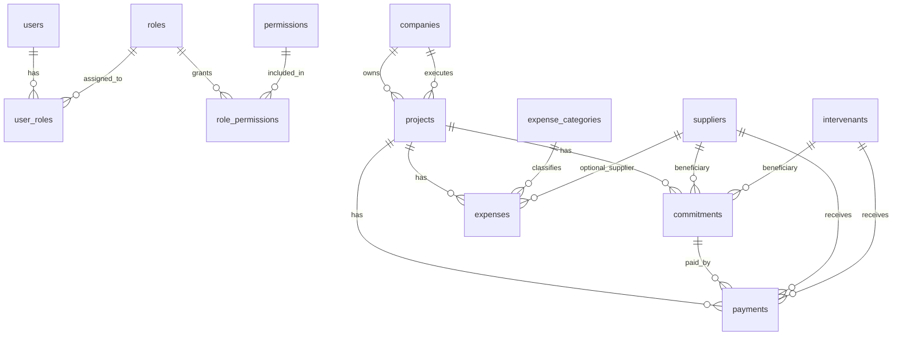

# BTP Manager MVP ERD

This document describes the Phase 3A database model implemented with Prisma and PostgreSQL.

## Scope

Implemented MVP entities:

- User
- Role
- Permission
- UserRole
- RolePermission
- Company
- Project
- Supplier
- Intervenant
- Commitment
- Payment
- ExpenseCategory
- Expense

## Entity Relationship Diagram

## Core Relationships

### Authentication and Authorization

- `users` can have many roles through `user_roles`.
- `roles` can have many permissions through `role_permissions`.
- Seeded roles are `Administrator`, `Project Manager`, `Accountant`, and `Viewer`.
- Seeded permissions cover dashboard, companies, projects, suppliers, intervenants, commitments, payments, expenses, construction, reports, administration, and audit access.

### Companies and Projects

- `companies` can own many projects through `projects.owner_company_id`.
- `companies` can execute many projects through `projects.executing_company_id`.
- `projects.executing_company_id` is required.
- Internal projects require `owner_company_id`.
- External client projects require `external_client_name` and must not have `owner_company_id`.

### Commitments and Payments

- `projects` have many `commitments`.
- Each `commitment` belongs to exactly one project.
- A commitment beneficiary is either a supplier or an intervenant, never both.
- `payments` belong to one commitment and one project.
- A database trigger enforces that payment project and beneficiary data match the linked commitment.

### Expenses

- `expenses` belong to one project.
- `expenses` belong to one expense category.
- `expenses` may optionally reference a supplier.
- Seeded expense categories match the BTP Manager blueprint categories.

## Audit and Soft Delete Strategy

Business tables include:

- `created_at`
- `updated_at`
- `deleted_at`

Audited business records also include:

- `created_by`
- `updated_by`
- `deleted_by`

Soft delete behavior:

- Records are not physically removed by default.
- Soft deletion is represented by setting `deleted_at`.
- Application queries must filter `deleted_at = null` unless explicitly viewing archived data.
- Indexes exist on `deleted_at` to keep active-record filtering efficient.

## Integrity Rules

Implemented at database level:

- UUID primary keys use `gen_random_uuid()` from PostgreSQL `pgcrypto`.
- Project expected end date cannot be before start date.
- Project actual end date cannot be before start date.
- Project ownership fields must match ownership type.
- Commitment amount must be positive.
- Commitment beneficiary must be supplier or intervenant, exclusively.
- Payment amount must be positive.
- Cheque payments require a cheque number.
- Payment beneficiary must be supplier or intervenant, exclusively.
- Payment project and beneficiary must match the linked commitment.
- Expense amount must be positive.

## Indexing Strategy

Indexes are implemented for:

- Search fields: names, email, ICE, city, category, trade.
- Status fields: user status, project status, record status, commitment status.
- Relationship fields: project IDs, company IDs, supplier IDs, intervenant IDs, category IDs.
- Financial dates: commitment date, payment date, expense date.
- Soft delete fields: `deleted_at`.

## Seeded Data

Roles:

- Administrator
- Project Manager
- Accountant
- Viewer

Default permissions:

- 36 permission records.
- 75 role-permission mappings.

Expense categories:

- Terrain
- Études
- Gros œuvre
- Main d'œuvre
- Fer
- Béton
- Aluminium
- Marbre
- Ascenseur
- Électricité
- Plomberie
- Taxes
- Divers
